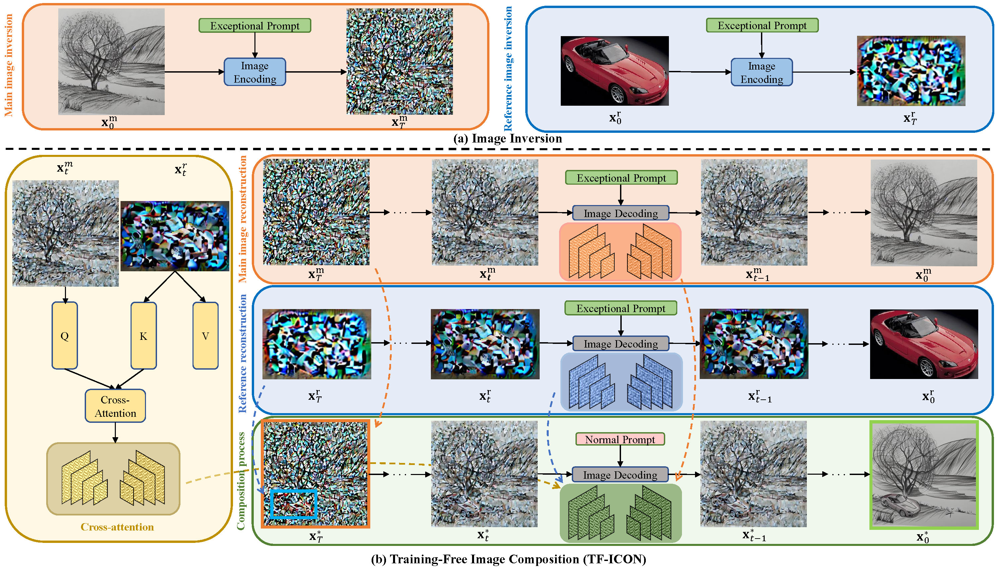

# TF-ICON: Diffusion-Based Training-Free Cross-Domain Image Composition (ICCV 2023)

## [<a href="https://shilin-lu.github.io/tf-icon.github.io/" target="_blank">Project Page</a>] [<a href="https://entuedu-my.sharepoint.com/:b:/g/personal/shilin002_e_ntu_edu_sg/EWRDLuFDrs5Ll0KGuMtvtbUBhBZcSw2roKCo96iCWgpMZQ?e=rEv3As" target="_blank">Poster</a>]

[](https://arxiv.org/abs/2307.12493) [](https://entuedu-my.sharepoint.com/:f:/g/personal/shilin002_e_ntu_edu_sg/EmmCgLm_3OZCssqjaGdvjMwBCIvqfjsyphjqNs7g2DFzQQ?e=JSwOHY)

Official implementation of [TF-ICON: Diffusion-Based Training-Free Cross-Domain Image Composition](https://shilin-lu.github.io/tf-icon.github.io/).

> **TF-ICON: Diffusion-Based Training-Free Cross-Domain Image Composition**<br>
<!-- > [Gwanghyun Kim](https://gwang-kim.github.io/), Taesung Kwon, [Jong Chul Ye](https://bispl.weebly.com/professor.html) <br> -->
> Shilin Lu, Yanzhu Liu, and Adams Wai-Kin Kong <br>
> ICCV 2023
> 
>**Abstract**: <br>
Text-driven diffusion models have exhibited impressive generative capabilities, enabling various image editing tasks. In this paper, we propose TF-ICON, a novel Training-Free Image COmpositioN framework that harnesses the power of text-driven diffusion models for cross-domain image-guided composition. This task aims to seamlessly integrate user-provided objects into a specific visual context. Current diffusion-based methods often involve costly instance-based optimization or finetuning of pretrained models on customized datasets, which can potentially undermine their rich prior. In contrast, TF-ICON can leverage off-the-shelf diffusion models to perform cross-domain image-guided composition without requiring additional training, finetuning, or optimization. Moreover, we introduce the exceptional prompt, which contains no information, to facilitate text-driven diffusion models in accurately inverting real images into latent representations, forming the basis for compositing. Our experiments show that equipping Stable Diffusion with the exceptional prompt outperforms state-of-the-art inversion methods on various datasets (CelebA-HQ, COCO, and ImageNet), and that TF-ICON surpasses prior baselines in versatile visual domains.

<!-- ## [<a href="https://pnp-diffusion.github.io/" target="_blank">Project Page</a>] [<a href="https://github.com/MichalGeyer/pnp-diffusers" target="_blank">Diffusers Implementation</a>] -->

<!-- [](https://arxiv.org/abs/2211.12572) [](https://huggingface.co/spaces/hysts/PnP-diffusion-features) <a href="https://replicate.com/arielreplicate/plug_and_play_image_translation"></a> [](https://www.dropbox.com/sh/8giw0uhfekft47h/AAAF1frwakVsQocKczZZSX6La?dl=0) -->


---

</div>



<!-- # Updates:

**19/06/23** 🧨 Diffusers implementation of Plug-and-Play is available [here](https://github.com/MichalGeyer/pnp-diffusers). -->

<!-- ## TODO:
- [ ] Diffusers support and pipeline integration
- [ ] Gradio demo
- [ ] Release TF-ICON Test Benchmark -->


<!-- ## Usage

**To plug-and-play diffusion features, please follow these steps:**

1. [Setup](#setup)
2. [Feature extraction](#feature-extraction)
3. [Running PnP](#running-pnp)
4. [TI2I Benchmarks](#ti2i-benchmarks) -->

---

</div>

## Contents
  - [Setup](#setup)
    - [Creating a Conda Environment](#creating-a-conda-environment)
    - [Downloading Stable-Diffusion Weights](#downloading-stable\-diffusion-weights)
  - [Running TF-ICON](#running-tf\-icon)
    - [Data Preparation](#data-preparation) 
    - [Image Composition](#image-composition)
  - [TF-ICON Test Benchmark](#tf\-icon-test-benchmark)
  - [Additional Results](#additional-results)
    - [Sketchy Painting](#sketchy-painting)
    - [Oil Painting](#oil-painting)
    - [Photorealism](#photorealism)
    - [Cartoon](#cartoon)
  - [Acknowledgments](#acknowledgments)
  - [Citation](#citation)


<br>

## Setup

Our codebase is built on [Stable-Diffusion](https://github.com/Stability-AI/stablediffusion)
and has shared dependencies and model architecture. A VRAM of 23 GB is recommended, though this may vary depending on the input samples (minimum 20 GB).

### Creating a Conda Environment

```
git clone https://github.com/Shilin-LU/TF-ICON.git
cd TF-ICON
conda env create -f tf_icon_env.yaml
conda activate tf-icon
```

### Downloading Stable-Diffusion Weights

Download the StableDiffusion weights from the [Stability AI at Hugging Face](https://huggingface.co/stabilityai/stable-diffusion-2-1-base/blob/main/v2-1_512-ema-pruned.ckpt)
(download the `sd-v2-1_512-ema-pruned.ckpt` file), and put it under `./ckpt` folder.

## Running TF-ICON

### Data Preparation

Several input samples are available under `./inputs` directory. Each sample involves one background (bg), one foreground (fg), one segmentation mask for the foreground (fg_mask), and one user mask that denotes the desired composition location (mask_bg_fg). The input data structure is like this:
```
inputs
├── cross_domain
│  ├── prompt1
│  │  ├── bgxx.png
│  │  ├── fgxx.png
│  │  ├── fgxx_mask.png
│  │  ├── mask_bg_fg.png
│  ├── prompt2
│  ├── ...
├── same_domain
│  ├── prompt1
│  │  ├── bgxx.png
│  │  ├── fgxx.png
│  │  ├── fgxx_mask.png
│  │  ├── mask_bg_fg.png
│  ├── prompt2
│  ├── ...
```

More samples are available in [TF-ICON Test Benchmark](#tf\-icon-test-benchmark) or you can customize them. Note that the resolution of the input foreground should not be too small. 

- Cross domain: the background and foreground images originate from different visual domains.
- Same domain: both the background and foreground images belong to the same photorealism domain.

### Image Composition
To execute the TF-ICON under the 'cross_domain' mode, run the following commands:

```
python scripts/main_tf_icon.py  --ckpt <path/to/model.ckpt/>      \
                                --root ./inputs/cross_domain      \
                                --domain 'cross'                  \
                                --dpm_steps 20                    \
                                --dpm_order 2                     \
                                --scale 5                         \
                                --tau_a 0.4                       \
                                --tau_b 0.8                       \
                                --outdir ./outputs                \
                                --gpu cuda:0                      \
                                --seed 3407                         
```

For the 'same_domain' mode, run the following commands:
```
python scripts/main_tf_icon.py  --ckpt <path/to/model.ckpt/>      \
                                --root ./inputs/same_domain       \
                                --domain 'same'                   \
                                --dpm_steps 20                    \
                                --dpm_order 2                     \
                                --scale 2.5                       \
                                --tau_a 0.4                       \
                                --tau_b 0.8                       \
                                --outdir ./outputs                \
                                --gpu cuda:0                      \
                                --seed 3407                         
```

- `ckpt`: The path to the checkpoint of Stable Diffusion.
- `root`: The path to your input data.
- `domain`: Setting 'cross' if the foreground and background are from different visual domains, otherwise 'same'. 
- `dpm_steps`: The diffusion sampling steps.
- `dpm_solver`: The order of the probability flow ODE solver.
- `scale`: The classifier-free guidance (CFG) scale.
- `tau_a`: The threshold for injecting composite self-attention maps.
- `tau_b`: The threshold for preserving background.

## TF-ICON Test Benchmark

The complete TF-ICON test benchmark is available in [this OneDrive folder](https://entuedu-my.sharepoint.com/:f:/g/personal/shilin002_e_ntu_edu_sg/EmmCgLm_3OZCssqjaGdvjMwBCIvqfjsyphjqNs7g2DFzQQ?e=JSwOHY). If you find the benchmark useful for your research, please consider citing.


<!-- You can find the **Wild-TI2I**, **ImageNetR-TI2I** and **ImageNetR-Fake-TI2I** benchmarks in [this dropbox folder](https://www.dropbox.com/sh/8giw0uhfekft47h/AAAF1frwakVsQocKczZZSX6La?dl=0). The translation prompts and all the necessary configs (e.g. seed, generation prompt, guidance image path) are provided in a yaml file in each benchmark folder. -->


## Additional Results
### Sketchy Painting


---

</div>

### Oil Painting


---

</div>

### Photorealism


---

</div>

### Cartoon


---

</div>

## Acknowledgments
Our work is standing on the shoulders of giants. We thank the following contributors that our code is based on: [Stable-Diffusion](https://github.com/Stability-AI/stablediffusion) and [Prompt-to-Prompt](https://github.com/google/prompt-to-prompt). 


## Citation
If you find the repo useful, please consider citing:
```
@inproceedings{lu2023tf,
  title={TF-ICON: Diffusion-Based Training-Free Cross-Domain Image Composition},
  author={Lu, Shilin and Liu, Yanzhu and Kong, Adams Wai-Kin},
  booktitle={Proceedings of the IEEE/CVF International Conference on Computer Vision},
  pages={2294--2305},
  year={2023}
}
```
